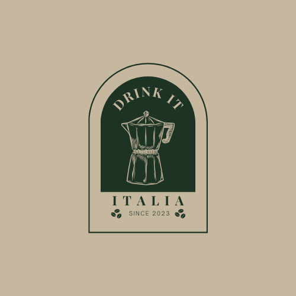
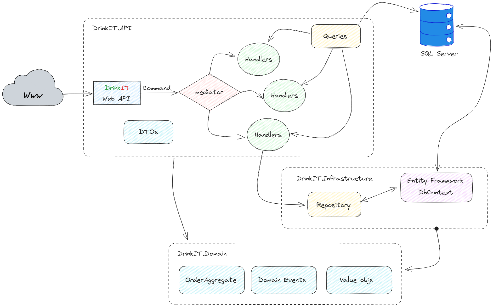

# DrinkIT(alia)

#### The best place to buy a hot drink.

## Dependencies

- [.Net 7](https://dotnet.microsoft.com/en-us/download/dotnet/7.0)
- [Docker](https://www.docker.com/)
- [Dotnet EF CLI](https://learn.microsoft.com/en-us/ef/core/cli/dotnet)

## How to run this repository
RUNME.ps1 will generate the db and api containers.

Access the swagger UI at: http://localhost:5148/swagger/index.html

## Simple diagram

This diagrams intends to help visualize how to projects are integrated

